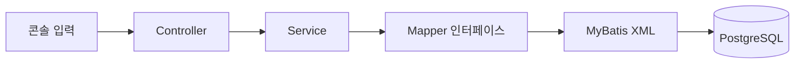

# 📚 Kyobo Mini Project

> **교보시네마 — 영화 예매 / 좌석 관리 시스템**

Java 콘솔에서 영화 검색부터 좌석 선택, 예매와 취소까지 처리하는 5인 팀 프로젝트입니다. 관리자는 영화와 상영회차, 상영관 및 좌석을 관리하고, 회원은 등록된 상영 정보를 바탕으로 영화를 예매합니다.

## 📌 프로젝트 소개

- **사용자**: 영화 목록·검색·상세 조회, 회원가입·로그인, 영화 예매, 예매 내역 조회·취소, 회원 탈퇴
- **관리자**: 관리자 인증, 영화 등록·삭제, 소속 영화관의 상영관·좌석 관리, 상영회차 조회·등록
- **운영 정책**: 영화 조회는 비회원도 가능하며, 예매는 회원 로그인 후 이용합니다. 관리자 계정으로 발권하는 기능은 제공하지 않습니다.
- **개발 목표**: 역할별 콘솔 흐름을 연결하고, 관계형 DB 설계와 MyBatis 기반 데이터 처리, 트랜잭션 및 팀 코드 리뷰를 경험합니다.

### 프로젝트 문서

| 문서 | 내용 |
| --- | --- |
| [팀 Notion](https://app.notion.com/p/3d8efd84a60d80fcae5cf89ae5630653) | 프로젝트 전체 자료, 회의록, 작업 현황 |
| [주제 정의서](https://app.notion.com/p/3ddefd84a60d80e49d6ad119e0735ac7) | 기획 및 주제 정의 |
| [요구사항 정의서](https://app.notion.com/p/3deefd84a60d80718a38dc1d38111701) | 요구사항과 우선순위 |
| [기능 명세서](https://app.notion.com/p/3dcefd84a60d80adb395c0e2d3e1af20) | F-01~F-18의 입력, 처리 흐름, 출력, 예외 처리 |
| [ERD](https://app.notion.com/p/3ddefd84a60d8077b25ad5a9c1dc8842) | 데이터베이스 설계 문서 |
| [발표 자료 구성](https://app.notion.com/p/3e3efd84a60d8058bfe0e9678a00caba) | 프로젝트 소개 및 기능 시연 구성 |

현재 구현은 콘솔 애플리케이션입니다. 기능별 호출 흐름은 기능 명세서에, 저장소의 DB 구조는 [schema.sql](app/src/main/resources/db/v1/schema.sql)에 정리되어 있습니다.

## 👥 Team

| 이름 | 역할 | 주요 담당 | GitHub |
| --- | --- | --- | --- |
| 박상희 | 팀장 | 콘솔 프로젝트 환경 구성, 회원가입·로그인·로그아웃, 상영회차 조회·등록, 영화별 예매 통계 | [Sangddong](https://github.com/Sangddong) |
| 김주형 | 팀원 | 관리자 모드, 영화 예매, 예매 내역 조회·취소, ERD 정리 | [jjang-gu-kim](https://github.com/jjang-gu-kim) |
| 김지민 | 팀원 | 영화 목록 조회, 제목·장르 검색, 회원 탈퇴, Windows UTF-8 출력 문제 해결 | [duke1327](https://github.com/duke1327) |
| 이광호 | 팀원 | 영화 등록·장르 연결, 영화 삭제 | [danielleee1128](https://github.com/danielleee1128) |
| 이정희 | 팀원 | 영화 상세 조회, 상영관 목록·좌석 조회 및 상태 관리 | [LJH0-0](https://github.com/LJH0-0) |

## 🛠 기술 스택

| 구분 | 기술 | 용도 |
| --- | --- | --- |
| 언어 | Java 21 | 콘솔 입출력 및 비즈니스 로직 |
| 빌드 | Gradle Wrapper 9.7.1 | 의존성 관리, 실행 및 빌드 |
| 데이터 접근 | MyBatis 3.5.19 | Mapper 인터페이스와 XML SQL 연결 |
| 데이터베이스 | PostgreSQL / Neon | 회원·영화·상영·예매 데이터 저장 |
| JDBC | PostgreSQL JDBC 42.7.13 | Java와 PostgreSQL 연결 |
| 보안 | jBCrypt 0.4, AES-GCM | 비밀번호 해시, 이름·전화번호 필드 암호화 |
| 코드 보조 | Lombok 1.18.42 | Entity 접근자 등 반복 코드 간소화 |
| 테스트 | JUnit Jupiter 6.0.1 | 자동화 테스트 |
| 협업 | Git, GitHub Issues·Projects·PR, Notion | 버전 관리, 작업 추적, 리뷰 및 문서화 |
| DB 관리 | DBeaver | 테이블 조회 및 SQL 실행 |

## 🎬 주요 기능

기능 ID는 팀 Notion의 기능 명세서를 기준으로 합니다.

| 기능 ID | 기능 | 주요 동작 |
| --- | --- | --- |
| F-01 | 회원가입 | 아이디 중복 및 입력값 검증, 비밀번호 해시와 개인정보 암호화 저장 |
| F-02 | 로그인 | 아이디·비밀번호 검증 후 로그인 사용자 정보 유지 |
| F-03 | 로그아웃 | 확인 후 로그인 상태 해제 |
| F-04 | 영화 목록 조회 | 앞으로 상영할 회차가 있는 영화와 장르 조회 |
| F-05 | 관리자 모드 | 관리자 코드·비밀번호 인증 후 소속 영화관 관리 메뉴 진입 |
| F-06 | 영화 예매 | 영화관·상영회차·좌석 선택 후 예매 및 좌석 정보 저장 |
| F-07 | 회원 탈퇴 | 예매 상태와 비밀번호 확인 후 소프트 삭제 |
| F-08 | 예매 내역 조회 | 로그인한 회원의 예매 정보 및 상태 조회 |
| F-09 | 영화 상세 조회 | 감독, 장르, 관람 연령, 상영시간, 개봉일, 줄거리 등 출력 |
| F-10 | 상영회차 조회 | 관리자 소속 영화관의 날짜별·상영관별 시간표 조회 |
| F-11 | 상영회차 등록 | 영화·상영관·날짜·시작 시간 선택 및 시간 중복 검증 |
| F-12 | 영화별 예매 통계 | 좌석 점유율 계산 및 순위 제공 |
| F-13 | 예매 취소 | 예매 상태 변경 및 해당 예매의 좌석 점유 해제 |
| F-14 | 영화 검색 | 제목 부분 검색 또는 장르별 필터링 |
| F-15 | 상영관 목록 조회 | 관리자 소속 영화관의 상영관 정보 조회 |
| F-16 | 상영관별 좌석 조회 | 좌석 배치와 사용 상태 조회 |
| F-17 | 영화 등록 | 영화 기본 정보와 복수 장르를 하나의 트랜잭션으로 저장 |
| F-18 | 영화 삭제 | 영화·장르 연결 삭제 후 영화 삭제, 참조 제약 발생 시 롤백 |

상영관·좌석 관리 메뉴에서는 사용 상태 변경도 지원합니다.

### 콘솔 이용 흐름

```text
프로그램 실행
├─ 비회원 홈
│  ├─ 영화 검색 / 영화 목록 → 영화 상세
│  ├─ 회원가입
│  └─ 로그인
├─ 회원 홈
│  ├─ 영화 검색 / 영화 목록 → 영화 상세 → 영화관·회차·좌석 선택 → 예매
│  ├─ 예매 내역 → 예매 취소
│  ├─ 로그아웃
│  └─ 회원 탈퇴
└─ 홈 메뉴에서 관리자 코드 입력 → 비밀번호 인증
   ├─ 영화 관리 → 등록 / 삭제
   ├─ 상영관 관리 → 상영관·좌석 조회 / 상태 변경
   └─ 상영회차 관리 → 조회 / 등록
```

## 🧩 구조 및 주요 구현



Controller는 메뉴·입력·결과 출력을 담당하고, Service는 검증과 트랜잭션을 처리합니다. Mapper 인터페이스의 메서드와 XML의 SQL을 MyBatis로 연결하며, Entity로 조회 결과와 저장할 데이터를 전달합니다.

```text
app/src/main/
├─ java/com/kyobo/server/
│  ├─ App.java        # 실행 진입점
│  ├─ controller/    # 회원·영화·예매·관리자 콘솔 흐름
│  ├─ service/       # 업무 규칙, 검증, 트랜잭션
│  ├─ mapper/        # SQL 호출 인터페이스
│  ├─ entity/        # 데이터 객체
│  ├─ config/        # 환경 변수, MyBatis, 암호화 설정
│  └─ common/        # 응답 객체, 화면 이동 신호 등
└─ resources/
   ├─ mapper/        # Mapper XML
   ├─ mybatis-config.xml
   └─ db/v1/schema.sql
```

### 회원 인증과 탈퇴

비밀번호는 BCrypt로 해시하고 이름·전화번호는 AES-GCM으로 암호화합니다. 로그인 실패 시 아이디 존재 여부와 비밀번호 오류를 같은 메시지로 안내합니다. 회원 탈퇴는 `is_deleted`, `deleted_at`을 갱신하며, 앞으로 관람할 유효 예매가 있으면 탈퇴를 제한합니다.

### 예매와 좌석 중복 방지

예매 1건과 선택한 좌석 여러 건을 같은 `SqlSession`에서 저장합니다. 좌석을 다시 검증하고 `(screening_id, seat_id)`의 UNIQUE 제약과 조건부 UPSERT로 이미 점유된 좌석의 중복 예매를 막습니다. 일부 좌석이라도 처리하지 못하면 전체 예매를 롤백합니다. 취소 시 예매 상태를 `CANCELED`로 바꾸고 좌석의 `is_active`를 해제해 다시 예매할 수 있도록 합니다.

### 영화 조회와 등록·삭제

영화와 장르는 `movie_genres`로 다대다 관계를 구성하고, 목록에서는 여러 장르를 집계해 출력합니다. 등록 시 DB에서 생성된 영화 ID를 받아 장르 연결에 사용합니다. 삭제는 장르 연결과 영화를 같은 트랜잭션에서 처리하며, 상영회차 등의 외래키 참조로 삭제할 수 없는 경우 변경을 롤백합니다.

### 상영회차 및 점유율

상영회차는 소속 영화관의 활성 상영관에 등록합니다. 시작 시간은 06시 이후 정각 또는 30분 단위이며, 영화 상영시간으로 종료 시간을 계산하고 회차 사이 60분의 정리 시간을 포함해 중복을 검사합니다. 영화별 점유율은 전체 영화관·전체 기간의 유효 예매 좌석 수를 회차별 활성 좌석 수의 합으로 나누어 계산합니다.

### 상영관·좌석 및 콘솔 출력

관리자 소속 영화관의 상영관과 좌석 상태를 조회·관리합니다. 좌석 배치를 콘솔에 표시하고, 한글 출력 문제를 줄이기 위해 Java 컴파일과 실행 출력 인코딩을 UTF-8로 설정합니다.

## 🗄 데이터베이스

| 영역 | 테이블 | 역할 |
| --- | --- | --- |
| 회원·관리자 | `users`, `admins` | 회원 인증·탈퇴 상태, 영화관별 관리자 정보 |
| 영화관·좌석 | `cinemas`, `rooms`, `seats` | 영화관, 소속 상영관, 물리 좌석과 사용 상태 |
| 영화·장르 | `movies`, `genres`, `movie_genres` | 영화 기본 정보 및 복수 장르 연결 |
| 상영 | `screenings` | 영화·영화관·상영관별 상영 날짜와 시작·종료 시간 |
| 예매 | `bookings`, `booked_seats` | 회원 예매, 예매 상태, 회차별 좌석 점유 |

설계 배경은 [ERD 문서](https://app.notion.com/p/3ddefd84a60d8077b25ad5a9c1dc8842)를 참고하고, 저장소 기준 컬럼·제약조건은 [스키마 파일](app/src/main/resources/db/v1/schema.sql)을 확인합니다.

## 🚀 실행 방법

### 1. 준비 및 저장소 받기

JDK 21과 접속 가능한 PostgreSQL DB가 필요합니다. Gradle은 저장소에 포함된 Wrapper를 사용합니다.

```bash
git clone https://github.com/kyobo-mini-project/server.git
cd server
```

### 2. 환경 설정

프로젝트 루트에서 `.env.example`을 `.env`로 복사하고 접속 정보를 입력합니다.

```dotenv
DB_URL=jdbc:postgresql://<호스트>:<포트>/<DB명>
DB_USERNAME=<DB 사용자>
DB_PASSWORD=<DB 비밀번호>
ENCRYPTION_SECRET=<개인정보 암호화용 비밀 문자열>
```

Neon을 이용하면 제공된 JDBC 연결 설정에 맞춰 SSL 옵션을 적용합니다. 같은 DB의 암호화된 데이터를 사용하는 팀원은 동일한 `ENCRYPTION_SECRET`을 사용해야 합니다. `.env`는 Git 추적에서 제외됩니다.

설정은 실행 위치 또는 상위 폴더의 `.env`에서 읽으며, 값이 없으면 동일한 이름의 환경 변수를 사용합니다.

### 3. 새 DB 초기화

스키마는 프로그램 시작 시 자동으로 적용되지 않습니다. 새 DB를 준비할 경우 DBeaver 등에서 아래 순서로 실행합니다.

1. 예매 상태 타입이 없는 새 DB에 다음 타입을 한 번 생성합니다.

   ```sql
   CREATE TYPE booking_status_type AS ENUM ('DONE', 'CANCELED');
   ```

2. [schema.sql](app/src/main/resources/db/v1/schema.sql)을 실행합니다. 현재 파일은 위 타입이 이미 존재한다는 전제로 작성되어 있습니다.
3. 영화관, 관리자, 상영관, 좌석, 장르의 초기 데이터를 준비합니다. 관리자 비밀번호는 BCrypt 해시로 저장해야 합니다.
4. 관리자 메뉴에서 영화와 앞으로 상영할 회차를 등록하고, 회원가입·로그인 후 예매를 진행합니다.

저장소에는 초기 데이터 자동 입력 스크립트가 없습니다. 영화만 등록하고 미래 상영회차를 등록하지 않으면 사용자 영화 목록에 표시되지 않을 수 있습니다.

### 4. 실행

Windows PowerShell:

```powershell
.\gradlew.bat :app:run --console=plain
```

macOS / Linux:

```bash
./gradlew :app:run --console=plain
```

IDE에서는 `com.kyobo.server.App`을 실행합니다. JDK 21과 콘솔 UTF-8 설정을 확인합니다.

### 5. 빌드 및 테스트

```powershell
.\gradlew.bat :app:build
.\gradlew.bat :app:test
```

macOS / Linux에서는 `./gradlew`로 실행합니다. 테스트 코드는 `app/src/test/java`에 있으며, 회원 탈퇴의 성공·실패 처리와 트랜잭션 흐름 등을 검증합니다.

## 🤝 협업 및 프로젝트 관리

### 회의와 문서

- 매일 **09:10 / 17:30**, 각 10분씩 스크럼을 진행해 완료한 일, 막힌 부분, 다음 작업을 공유합니다.
- GitHub Issues·Projects로 작업을 추적하고, Notion에 기능 명세와 회의·의사결정을 기록합니다.
- 기능을 완료하면 구현 내용에 맞춰 명세서와 작업 상태를 갱신합니다.

### 작업 흐름

```text
Issue 작성·할당 → In Progress → 최신 main에서 브랜치 생성
→ 구현·실행·빌드 확인 → 기능 명세 갱신 → PR → 팀원 리뷰 → main 병합
```

기능 추가와 버그 수정은 저장소의 Issue 템플릿을 사용합니다. 상세 진행 규칙은 [Workflow](https://app.notion.com/p/3deefd84a60d80ea8248f13423bb6299)에 정리되어 있습니다.

### Branch / Commit

GitHub Flow를 사용하며, `main`에서 기능·수정 브랜치를 분기합니다.

| 구분 | 규칙 | 예시 |
| --- | --- | --- |
| 브랜치 | `{type}/{이니셜}/{영문_작업명}` | `feat/LGH/update_readme` |
| 커밋 | `{type}: {한글 작업 내용}` | `feat: 영화 등록 기능 구현` |
| 타입 | `feat` 일반 작업·기능 추가, `fix` 오류 수정 | `fix: 영화 검색 입력 검증 수정` |

상세 규칙: [Commit & Branch Convention](https://app.notion.com/p/3dcefd84a60d807ea832c4508e52b74f)

### Pull Request / Code Review

- 로컬 실행과 빌드를 확인한 뒤 PR을 작성합니다.
- PR 템플릿에 작업 내용, 확인 사항, 화면 및 스키마 변경 여부, 관련 Issue를 기록합니다.
- 다른 팀원을 모두 리뷰어로 지정하고 Development 항목에 Issue를 연결합니다.
- 수정 의견은 해당 코드에 구체적으로 남기고, 검토를 마치면 Approve합니다.
- 전원 리뷰를 마친 후 마지막 승인자가 병합 가능 여부를 확인하고 병합합니다.

상세 규칙: [Code Review](https://app.notion.com/p/3dcefd84a60d80c49469c1fe615a36e1)

### 코드 컨벤션

클래스·인터페이스는 `PascalCase`, 메서드·변수는 `camelCase`, 상수는 `UPPER_SNAKE_CASE`를 사용합니다. 들여쓰기는 공백 4칸으로 맞추며, DB 테이블·컬럼은 `snake_case`로 작성합니다.

상세 규칙: [Code Convention](https://app.notion.com/p/3dcefd84a60d80eb8f9be0f7ac47ac8a)
